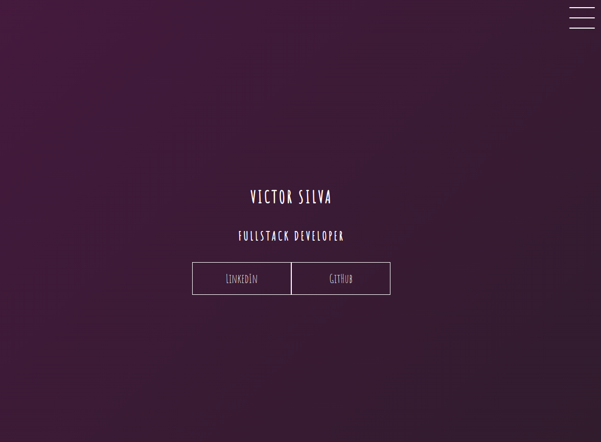

  
  
<a href="https://css-transitions-flax.vercel.app/">CLICK HERE FOR FULL PAGE<a>

    
# English :canada:
Portfolio mockup using CSS transitions properties.

## CSS :art:
The CSS portion of this project is heavily compartmentalized. 
Key transitions features:
- hamburger menu turns into an "x" when clicked;
- smooth menu opening;
- wave-like effect on the page's header;
- hover effects showing details in each picture.
 
It's also worth saying the website is responsive and should cover every screen size :nerd_face:

# Português :brazil:
Mockup de um portfólio utilizando propriedades do CSS transitions.

## CSS :art:
A seção CSS do projeto é fortemente componetizada. 
Principais transitions da página:
- menu hambúrger se transorma em um "x" quando clicado;
- aparecimento suave do menu;
- efeito estilo "onda" no header da página;
- efeitos de hover em cada foto, mostrando mais detalhes.
 
Também é válido dizer que a página é responsiva e deve cobrir todos os tamanhos de tela :nerd_face:.
