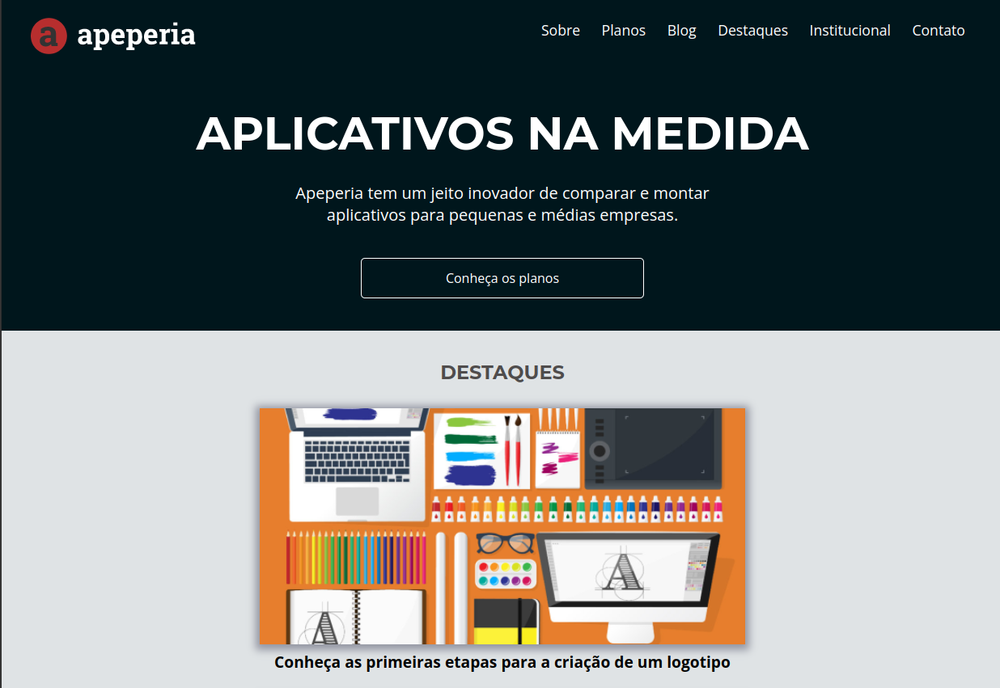

  
  
<a href="https://html-css-iota.vercel.app/">CLICK HERE FOR FULL PAGE<a>

    
# English :canada:
Landing page for a fictional app development company. 
Although this project's content is written in Brazilian Portuguese, the design and sections can be easily understood.

## CSS :art:
While the HTML portion of the website is pretty straight-forward, the CSS folder is divided into four sections:
- Base and Reset CSS;
- Header;
- Main;
- Footer.
 
All the positioning was done through the *flex* property.

### Things to improve
I developed this project a while ago. Given it's a simple landing page, not much needed to be done to add screen responsivity. 
Even though the responsivity portion of the code is fairly readable, I'd still like to separate all the @media queries in a new file/folder. 
That would improve readability, as well as shave off a few lines of code.

# Português :brazil:
Landing page de uma empresa (fictícia) de desenvolvimendo de apps.

## CSS :art:
Enquanto o HTML da página é bem direto e simples, o CSS é dividido em quatro seções:
- Base and Reset CSS;
- Header;
- Main;
- Footer.
 
Todo o posicionamento de elementos foi feito pela propriedade *flex*.

### Pontos a melhorar
O projeto foi desenvolvido já há um tempo. Por se tratar de uma landing page, não foi necessário muito para implementar responsividade à página. 
Embora as seções tratando de responsividade sejam bem legíveis, gostaria de separar todos os @media queries em um novo arquivo/diretório. 
Tal cuidado melhoraria a legibilidade, além de reduzir algumas linhas de código.
