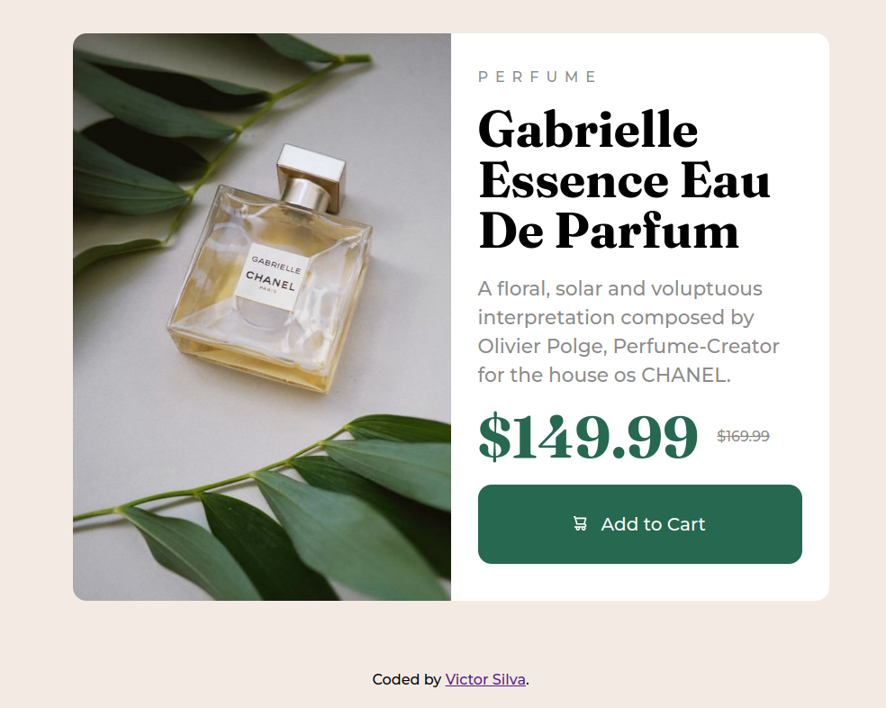

  
  
<a href="https://product-preview-card-component-henna.vercel.app/">CLICK HERE FOR FULL PAGE<a>

    
# English :canada:
This product card component was a challange proposed by <a href="https://www.frontendmentor.io/challenges">Frontend Mentor.</a> 
    
    
## CSS :art:
The CSS portion (found in assets) was divided into three sections:
- Normalize (reset) CSS;
- style (one single page due to project's simplicity);
- responsive (where all media queries were stored for screen responsivity).
 
All the positioning was done through the flex property.

# Português :brazil:
Projeto de desafio proposto por <a href="https://www.frontendmentor.io/challenges">Frontend Mentor.</a> 

## CSS :art:
O CSS do projeto foi dividido em três seções:
- Normalize (reset) CSS;
- style (apenas um arquivo devido a simplicidade do projeto);
- responsive (onde todas as media queries foram armazenadas para responsividade da tela).
 
Todo o posicionamento de elementos foi feito pela propriedade flex.
