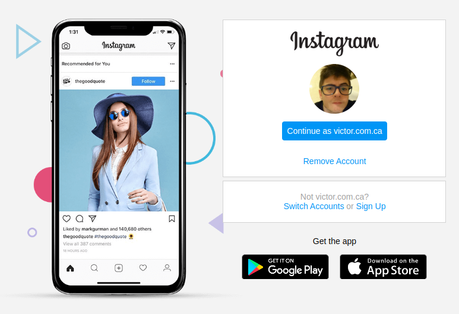

  

    
# English :canada:
Static clone of Instagram's Login Page.
    
## CSS :art:
The CSS portion was divided into three sections:
- Reset CSS;
- content (one single file due to project's simplicity);
- responsive (where all media queries were stored for screen responsivity).
 
All the positioning was done through the flex and grid properties.

# Português :brazil:
Clone estático da página de Login do Instagram.

## CSS :art:
O CSS do projeto foi dividido em três seções:
- Reset CSS;
- Content (apenas um arquivo devido a simplicidade do projeto);
- responsive (onde todas as media queries foram armazenadas para responsividade da tela).
 
Todo o posicionamento de elementos foi feito pelas propriedades flex e grid.
